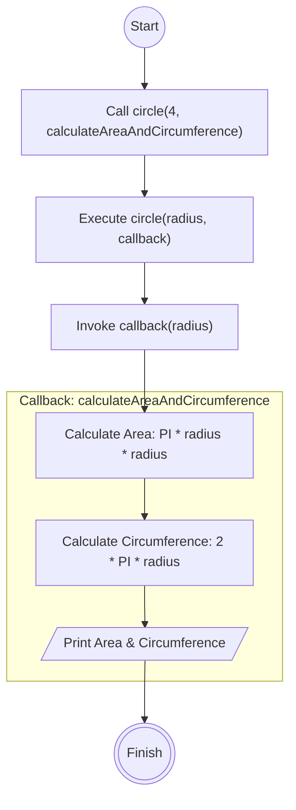

# Callback

## Area and Circumference Edition

```mermaid
flowchart TD
A@{shape: circle, label: 'Start'}
B@{ shape: process, label: "Call circle(4, calculateAreaAndCircumference)" }
C@{ shape: process, label: "Execute circle(radius, callback)" }
D@{ shape: process, label: "Invoke callback(radius)" }

subgraph CB [Callback: calculateAreaAndCircumference]
    E@{ shape: process, label: "Calculate Area: PI * radius * radius" }
    F@{ shape: process, label: "Calculate Circumference: 2 * PI * radius" }
    G@{ shape: lean-r, label: "Print Area & Circumference" }

    E --> F --> G
end
Z@{shape: dbl-circ, label: 'Finish'}


A --> B --> C --> D --> E
    G --> Z
```
