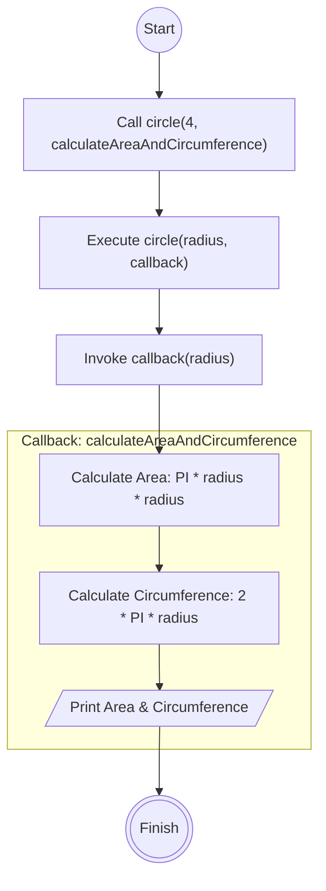

# Callback

## Area and Circumference Edition



```
1. Create a main function called 'circle' with 2 parameters, radius and callback function which receives argument of the radius.
2. Create a callback function called 'calculateAreaAndCircumference'. In it there is a calculation for the area and circumference.
3. 'calculateAreaAndCircumference' function will also console the result of both area and cicumference of the cirlce.
```
