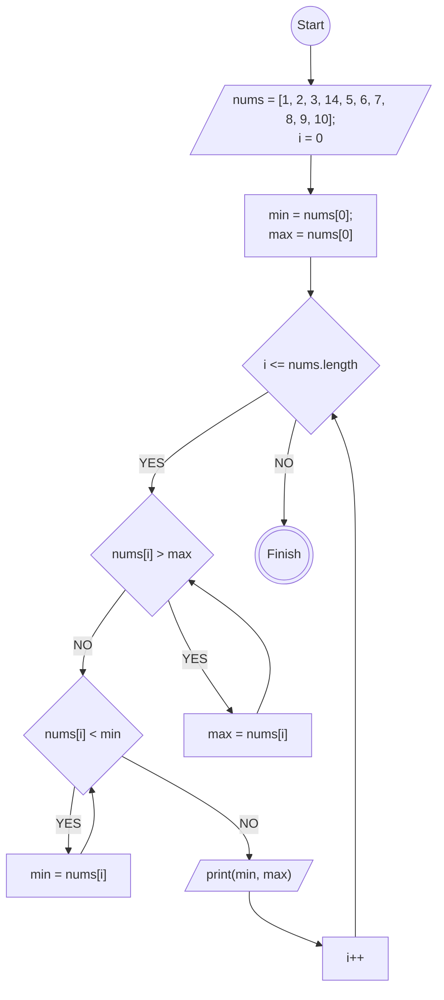

# Minitask JS2

## Edition: Finding Max, Min, and Avg of an array of numbers

### Find Max

```mermaid
flowchart TD

A@{shape: circle, label: 'Start'}
B@{shape: lean-r, label: 'nums = [1, 2, 3, 14, 5, 6, 7, 8, 9, 10];<br>i = 0'}
C@{shape: rectangle, label: 'min = nums[0]; <br>max = nums[0]'}
D@{shape: diamond, label: 'i <= nums.length'}
E@{shape: diamond, label: 'nums[i] > max'}
F@{shape: diamond, label: 'nums[i] < min'}
G@{shape: rectangle, label: 'min = nums[i]'}
H@{shape: rectangle, label: 'max = nums[i]'}
I@{shape: lean-r, label: 'print(min, max)'}
Y@{shape: rectangle, label: 'i++'}
Z@{shape: dbl-circ, label: 'Finish'}

A-->B-->C-->D
D-->|YES|E
D-->|NO|Z
E-->|YES|H
H-->E
E-->|NO|F
F-->|YES|G
G-->F
F-->|NO|I
I-->Y
Y-->D

```
